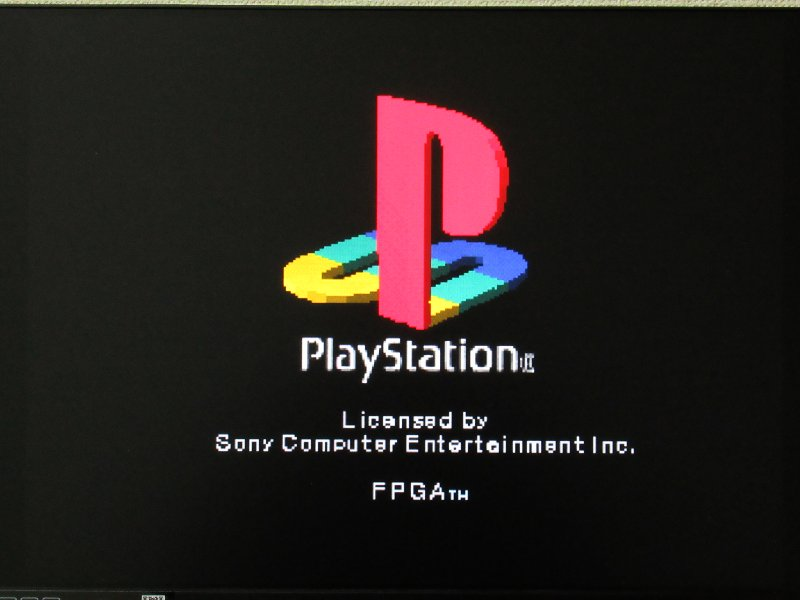
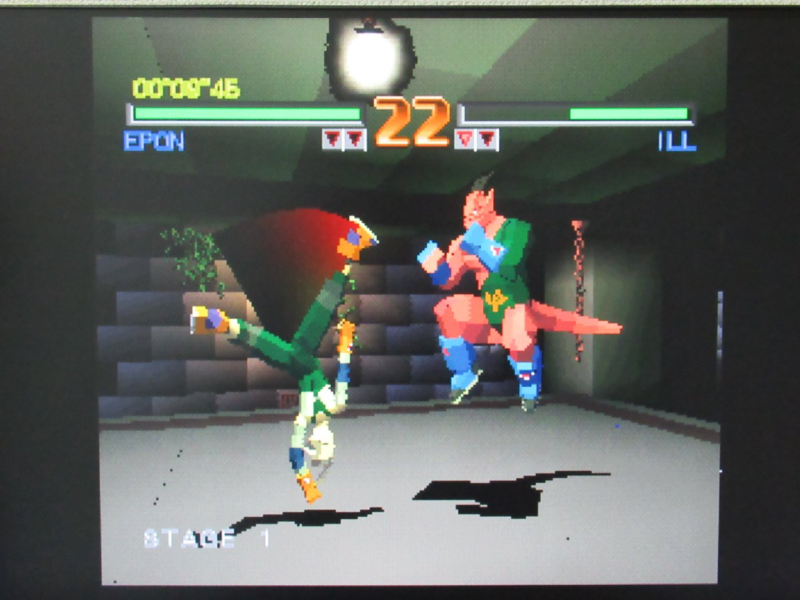
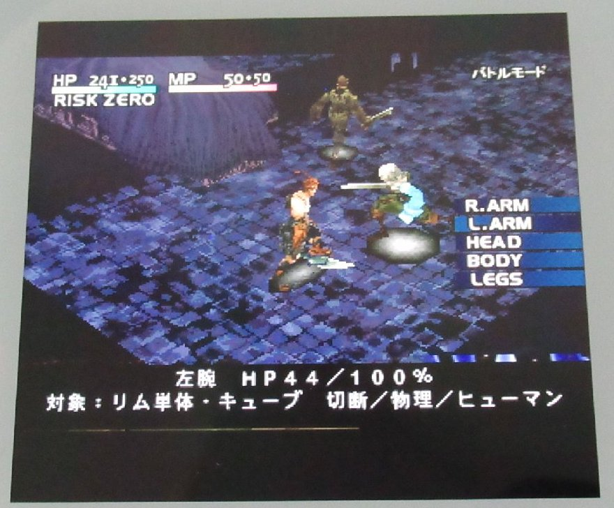
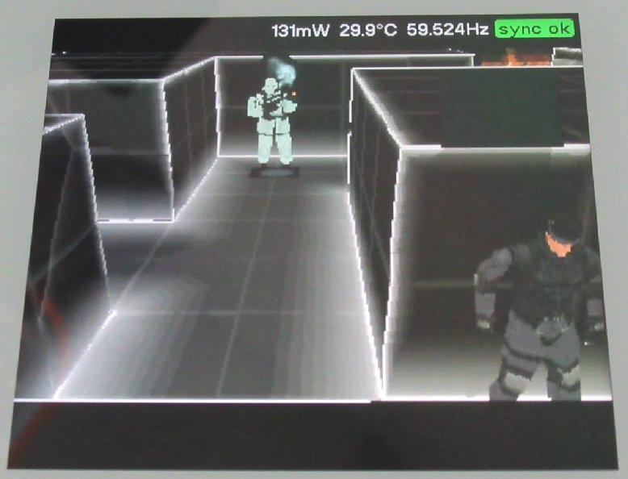
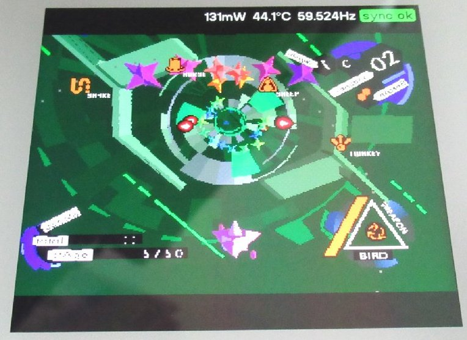
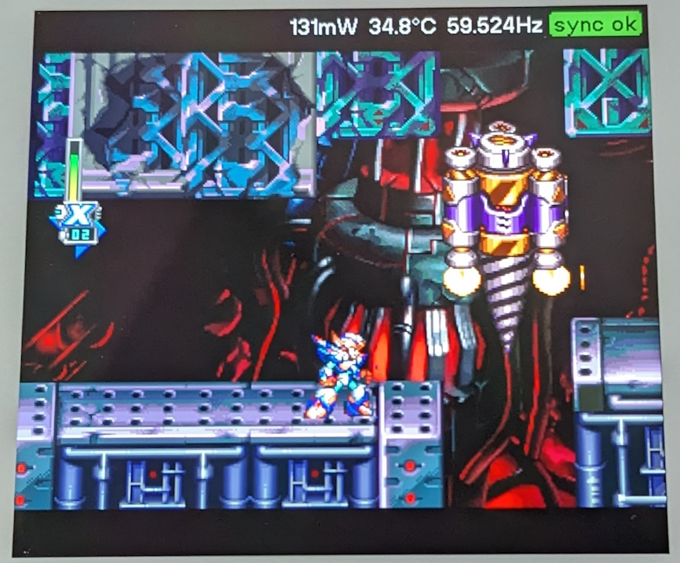
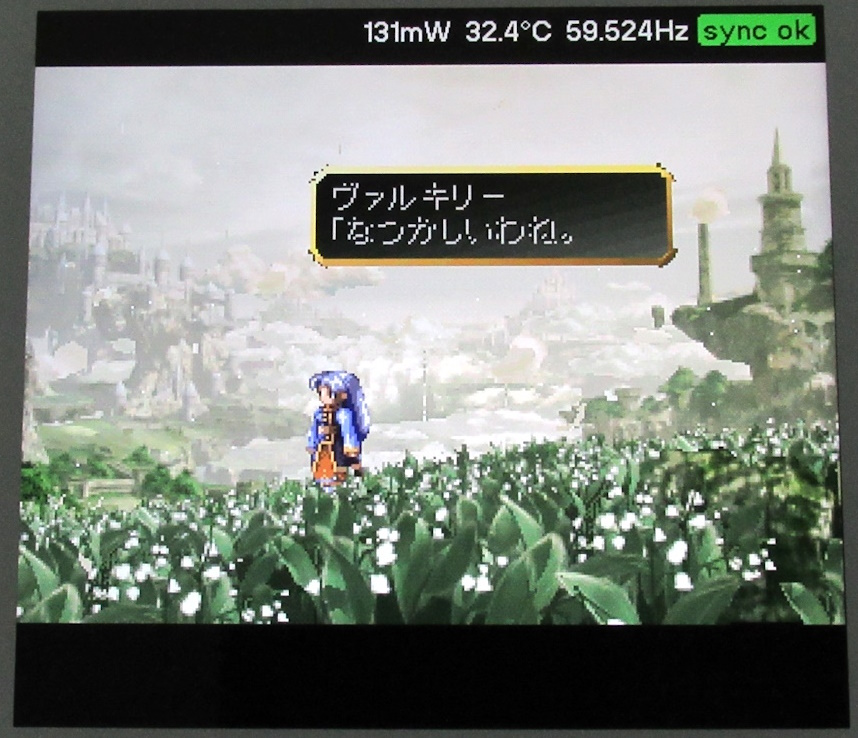
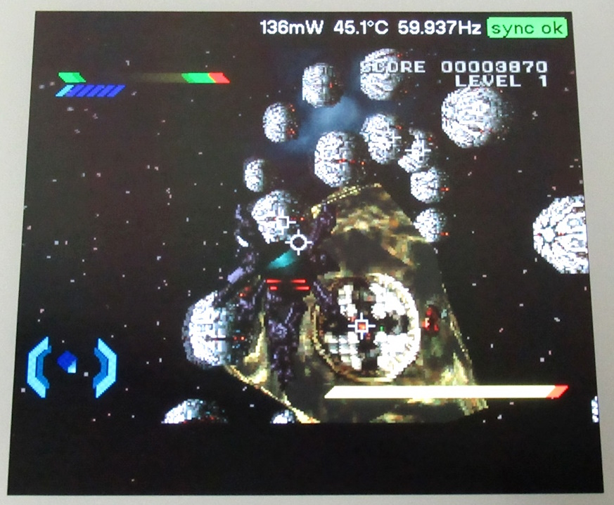

# PlayStation on FPGA
implemented PlayStation on an FPGA.  

<!--
When executing with the Terasic DE2-115 FPGA board, write the BIOS of SCPH-5500 to address 0 of the flash memory.
Reset is BUTTON 0.  
<pre>
 SW17 SW16:
  0    0     SONY logo -> PS logo.
  0    1     My polygon demo.
  1    0     SONY logo -> "Not a PlayStation standard disc"
  1    1     SONY logo -> Main menu view.
</pre>
-->

<a target=_blank href="https://pgate1.at-ninja.jp/PSX_on_FPGA/">PlayStation Sound Player on FPGA</a>  
<a target=_blank href="https://www.youtube.com/watch?v=2PupKQtSOCA">PlayStation on FPGA feat. DE2-115 (Run kernel)</a>  
<a target=_blank href="https://www.youtube.com/watch?v=xV6hRjSPIlo">PlayStation on FPGA feat. Pocket (No sound, movie. The frame rate is slow because the main memory and vram are shared.)</a>  
  
<!--
2019/11/12  
Run BIOS.  

2020/07/09  
Add texture and dither.  

2020/09/05  
Add CDROM controller.  

2021/02/25  
Add geometry engine for viewing PS logo.  

  
Tobal No.1 play  

  
Einhander play  

  
Metalgear Solid demo  

  
2022/03/27  
Add MemoryCard Controller for Saga Frontier 2.  

-->

## Screenshots

## Working game list

Here's a list of games that work a little. There may be other games that work as well.

- Einhander
- Ridge Racer
- Tobal No.1
- iS internal section
- Saga Frontier 2
- Dewprism
- Vagrant Story
- RayStorm
- Raycrisis
- Rockman X4
- Rockman X5
- Rockman X6
- Ace Combat 2
- XI
- Love & Destroy
- Metal Gear Solid Integral VR disc
- Valkyrie Profile
- Omega Boost
- Final Fantasy Tactics

User reports.

- GUNPEY
- Speed Power Gunbike
- Rakugaki Showtime
- Mr. Driller
- Harmful Park
- Runabout
- Kaette Kita Cyborg Kurochan
- Bloody Roar

